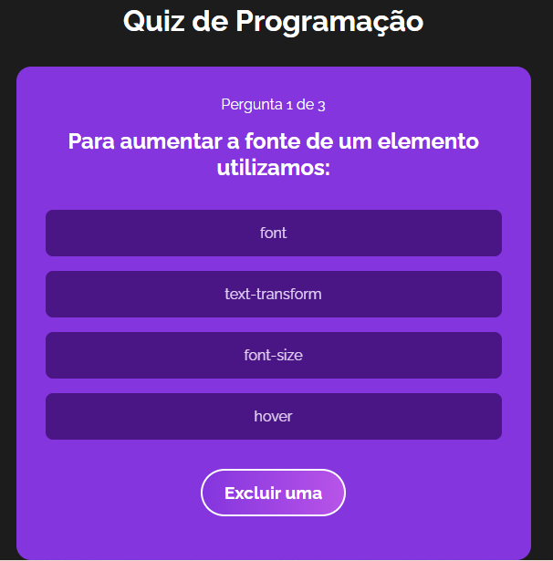
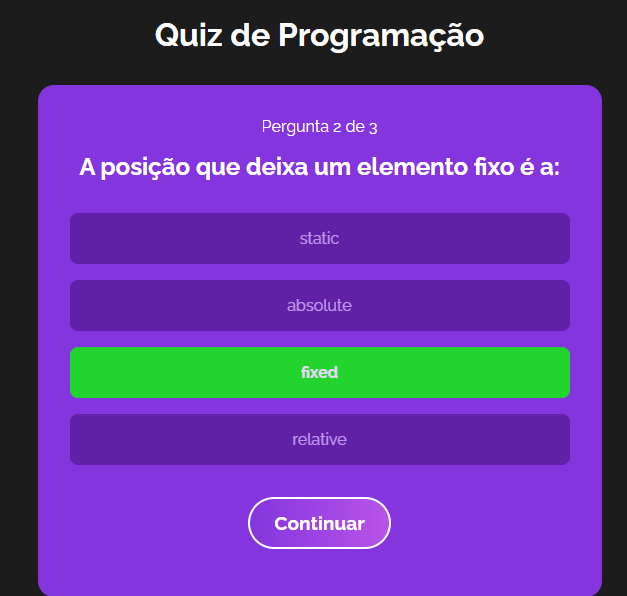

## 🧾 Descrição

O projeto "quiz_react" é um aplicativo web de perguntas e respostas desenvolvido em React. Ele oferece uma série de perguntas de múltipla escolha em diferentes categorias de programação, como HTML, CSS e Javascript. O usuário pode selecionar uma categoria e responder a perguntas até completar o quiz.

Projeto desenvolvido durante as aulas do 'Hora de Codar'.

<h1>

## 🔌 Tecnologias utilizadas

- **React:** biblioteca JavaScript para criação de interfaces de usuário.
- **React-DOM:** biblioteca para integração do React com a árvore de elementos do DOM.
- **React-Scripts:** conjunto de scripts de configuração e build para projetos React.
- **Vite:** build tool e servidor de desenvolvimento para projetos front-end.

## ⚙️ Estrutura

- **src:** Contém todo o código-fonte da aplicação, incluindo componentes, arquivos de estilização, imagens e outros recursos necessários.
- **img:** Contém imagens utilizadas no projeto e para apresentação no Readme.md.
- **pasta raiz:** Contém arquivos estáticos, como o arquivo index.html, que é a página principal da aplicação.
- **node_modules:** Contém todas as dependências do projeto, incluindo bibliotecas e módulos que foram instalados via npm.
- **package.json:** Contém informações sobre o projeto, incluindo suas dependências, scripts de execução e outras configurações relevantes.
- **package-lock.json:** Contém informações detalhadas sobre as dependências do projeto, incluindo as versões específicas que foram instaladas.
- **vite.config:** Servidor de desenvolvimento integrado, que permite visualizar e atualizar as alterações em tempo real no navegador

## 🏳️ Como executar?

### **Passo 1**
Abra o terminal ou prompt de comando no diretório do projeto baixado;

### **Passo 2**
Execute o comando ```npm install``` para instalar as dependências do projeto;

### **Passo 3**
Após a instalação das dependências, execute o comando ```npm run dev```;

### **Passo 4**
Aguarde o processo de compilação e abra o navegador no endereço http://localhost:3000.

<br>

## ✅ Resultado (Preview)

### **Início**


<br>

### **Pergunta**


<br>

### **Resposta**

<br>


<br>

## 💻 Autor: Luan Ferreira

Portfólio:
- [Github](https://github.com/fluanbrito)

Contato:
- [Linkedin](https://www.linkedin.com/in/luanferreirab/)

<h1>

## 🚀 Sobre mim
Sou um grande entusiasta e apaixonado por tecnologia, empreendedorismo e inovação. Hoje, estou a cursar o curso de Sistema de Informação pelo Instituto Federal, faço uso profissionalmente de ferramentas e me aprofundo em temas como Marketing, Machine Learning AWS, Metodologias ágeis, Gestão de Projetos, Programação Web, Administração de Sistemas, Redes de computadores, entre outros.